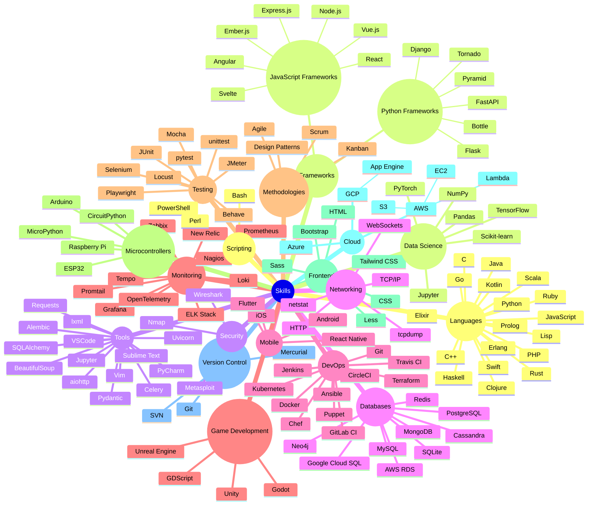

[//]: # (
)

[//]: # (  )

[//]: # (
)

 
  
Visitor count

  

```mermaid
mindmap
  root((Skills))
    ((Languages))
      Python
      JavaScript
      C++
      C
      Java
      Haskell
      Clojure
      Elixir
      Erlang
      Go
      Rust
      Kotlin
      Swift
      Ruby
      PHP
      Scala
      Lisp
      Prolog
    ((Frameworks))
      ((Python Frameworks))
        FastAPI
        Django
        Flask
        Pyramid
        Tornado
        Bottle
      ((JavaScript Frameworks))
        React
        Angular
        Vue.js
        Node.js
        Express.js
        Svelte
        Ember.js
    ((Tools))
      Pydantic
      SQLAlchemy
      Alembic
      Celery
      Uvicorn
      lxml
      BeautifulSoup
      Requests
      aiohttp
      VSCode
      PyCharm
      Sublime Text
      Vim
      Jupyter
    ((Databases))
      PostgreSQL
      SQLite
      MySQL
      MongoDB
      Cassandra
      Redis
      Neo4j
      AWS RDS
      Google Cloud SQL
    ((DevOps))
      Git
      Docker
      Jenkins
      Kubernetes
      Ansible
      Terraform
      Puppet
      Chef
      Travis CI
      CircleCI
      GitLab CI
    ((Monitoring))
      Grafana
      Prometheus
      Tempo
      Loki
      Promtail
      OpenTelemetry
      ELK Stack
      Nagios
      Zabbix
      New Relic
    ((Testing))
      pytest
      unittest
      Behave
      Selenium
      Playwright
      JUnit
      Mocha
      JMeter
      Locust
    ((Microcontrollers))
      Arduino
      Raspberry Pi
      ESP32
      MicroPython
      CircuitPython
    ((Frontend))
      HTML
      CSS
      Sass
      Less
      Bootstrap
      Tailwind CSS
    ((Cloud))
      AWS
        EC2
        S3
        Lambda
      GCP
        App Engine
      Azure
    ((Version Control))
      Git
      SVN
      Mercurial
    ((Scripting))
      Bash
      PowerShell
      Perl
    ((Data Science))
      NumPy
      Pandas
      Scikit-learn
      TensorFlow
      PyTorch
      Jupyter
    ((Security))
      Wireshark
      Metasploit
      Nmap
    ((Networking))
      tcpdump
      netstat
      HTTP
      TCP/IP
      WebSockets
    ((Mobile))
      Android
      iOS
      React Native
      Flutter
    ((Game Development))
      Unity
      Unreal Engine
      Godot
      GDScript
    ((Methodologies))
      Agile
      Scrum
      Kanban
      Design Patterns
```